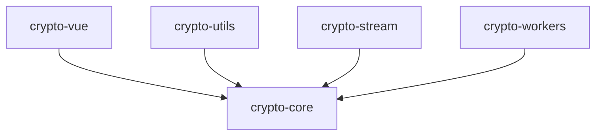

# @ldesign/crypto 子包架构

> 🔐 Monorepo 架构 - 模块化、可维护、可扩展

## 📦 包结构

`@ldesign/crypto` 采用 monorepo 架构，分为多个独立的子包，每个子包专注于特定功能：

```
@ldesign/crypto/
├── packages/
│   ├── core/           # 核心加密功能（框架无关）
│   ├── vue/            # Vue 3 适配器
│   ├── utils/          # 工具函数
│   ├── stream/         # 流式加密
│   └── workers/        # Worker 线程池
├── demo/               # 演示项目
├── examples/           # 示例项目
└── docs/               # 文档
```

## 🎯 子包说明

### [@ldesign/crypto-core](./packages/core)

**核心加密功能包** - 框架无关

- 🔒 AES/RSA/DES 加密算法
- #️⃣ MD5/SHA 哈希算法
- 🔑 密钥生成和管理
- 📝 数字签名
- ⚡ 性能优化

```bash
pnpm add @ldesign/crypto-core
```

```typescript
import { encrypt, decrypt, hash } from '@ldesign/crypto-core'

// AES 加密
const encrypted = await encrypt.aes('data', 'key')
// SHA-256 哈希
const hash256 = await hash.sha256('data')
```

---

### [@ldesign/crypto-vue](./packages/vue)

**Vue 3 适配器** - Composables + Plugin

- 🎯 Vue 3 Composables
- 🔌 Plugin 系统
- ⚡ 响应式加密操作

```bash
pnpm add @ldesign/crypto-vue @ldesign/crypto-core
```

```vue
<script setup lang="ts">
import { useCrypto } from '@ldesign/crypto-vue'

const { encrypt, decrypt, loading } = useCrypto()
</script>
```

---

### [@ldesign/crypto-utils](./packages/utils)

**工具函数包** - 实用工具集

- 💪 密码强度检测
- 🔑 密钥派生 (PBKDF2)
- 🔄 密钥轮换
- 💾 安全存储
- 🚦 速率限制
- 📊 性能监控

```bash
pnpm add @ldesign/crypto-utils
```

```typescript
import { PasswordStrengthChecker, KeyDerivation } from '@ldesign/crypto-utils'

// 密码强度检测
const checker = new PasswordStrengthChecker()
const analysis = checker.analyze('MyP@ssw0rd123')

// 密钥派生
const derived = await KeyDerivation.derive('password', 'salt')
```

---

### [@ldesign/crypto-stream](./packages/stream)

**流式加密包** - 大文件处理

- 📁 文件加密/解密
- 🌊 流式处理
- 💾 内存优化
- 📊 进度回调

```bash
pnpm add @ldesign/crypto-stream
```

```typescript
import type { IStreamEncryptor } from '@ldesign/crypto-stream'

// 流式加密大文件
// const encryptor: IStreamEncryptor = ...
```

---

### [@ldesign/crypto-workers](./packages/workers)

**Worker 线程池** - 并行处理

- 🔀 并行加密
- 🧵 Web Worker 池
- ⚡ 性能提升
- 📊 负载均衡

```bash
pnpm add @ldesign/crypto-workers
```

```typescript
import { getGlobalWorkerPool } from '@ldesign/crypto-workers'

const pool = getGlobalWorkerPool()
// 并行加密多个数据
```

## 🔧 开发指南

### 构建所有子包

```bash
# 构建所有子包
pnpm build

# 构建特定子包
pnpm build:core
pnpm build:vue
pnpm build:utils
```

### 开发模式

```bash
# 所有子包开发模式（watch）
pnpm dev

# 单个子包开发模式
cd packages/core
pnpm dev
```

### 测试

```bash
# 测试所有子包
pnpm test

# 测试单个子包
pnpm --filter @ldesign/crypto-core test
```

### 清理

```bash
# 清理所有构建产物
pnpm clean
```

## 📊 包依赖关系



**依赖说明**：
- `crypto-core` 是核心包，其他包都依赖它
- `crypto-vue` 为 Vue 3 应用提供适配器
- `crypto-utils` 提供额外的工具函数
- `crypto-stream` 和 `crypto-workers` 提供高级功能

## 🚀 快速开始

### 安装

根据需要安装相应的包：

```bash
# 仅需核心功能
pnpm add @ldesign/crypto-core

# Vue 3 项目
pnpm add @ldesign/crypto-core @ldesign/crypto-vue

# 需要工具函数
pnpm add @ldesign/crypto-core @ldesign/crypto-utils

# 完整安装
pnpm add @ldesign/crypto-core @ldesign/crypto-vue @ldesign/crypto-utils @ldesign/crypto-stream @ldesign/crypto-workers
```

### 使用

```typescript
// 框架无关使用
import { encrypt, hash } from '@ldesign/crypto-core'

// Vue 3 使用
import { useCrypto } from '@ldesign/crypto-vue'

// 工具函数使用
import { PasswordStrengthChecker } from '@ldesign/crypto-utils'
```

## 🎯 包选择指南

| 场景 | 推荐包 |
|------|--------|
| 基础加密/解密 | `@ldesign/crypto-core` |
| Vue 3 项目 | `@ldesign/crypto-core` + `@ldesign/crypto-vue` |
| 密码强度检测 | `@ldesign/crypto-core` + `@ldesign/crypto-utils` |
| 大文件加密 | `@ldesign/crypto-core` + `@ldesign/crypto-stream` |
| 并行处理 | `@ldesign/crypto-core` + `@ldesign/crypto-workers` |
| 完整功能 | 所有包 |

## 📝 版本管理

所有子包版本保持同步：

- 当前版本：`2.0.0`
- 主版本更新会影响所有子包
- 补丁更新可能只影响部分子包

## 🔗 相关链接

- [主包 README](./README.md)
- [核心包文档](./packages/core/README.md)
- [Vue 包文档](./packages/vue/README.md)
- [演示项目](./demo/README.md)

## 📄 许可证

MIT © [LDesign Team](https://github.com/ldesign)


