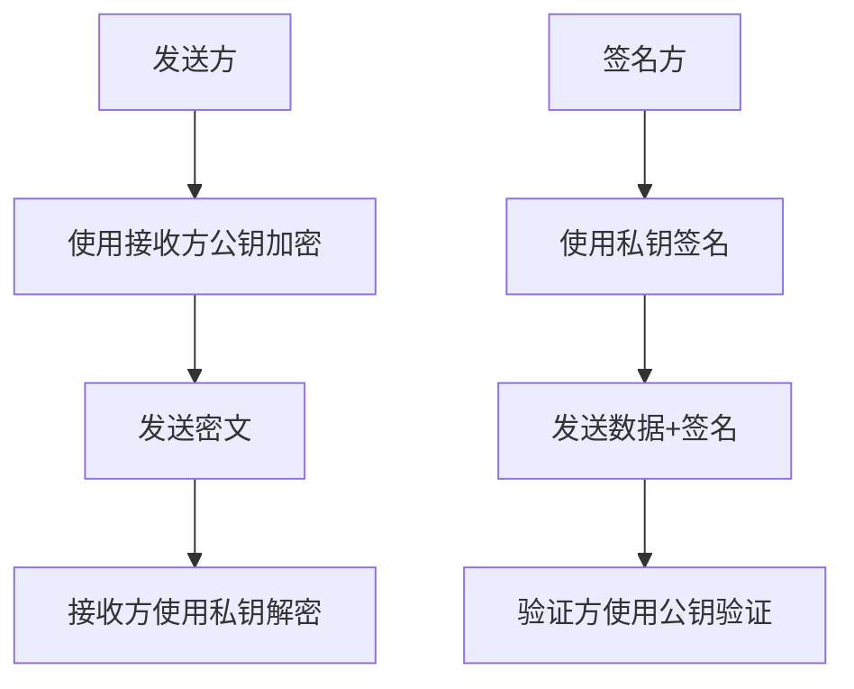

# 非对称加密

非对称加密使用一对密钥：公钥和私钥。公钥可以公开分享，私钥必须保密。

## 核心概念

### 密钥对的作用

- **公钥加密，私钥解密**: 用于数据加密传输
- **私钥签名，公钥验证**: 用于数字签名和身份认证



### 优势与劣势

**优势:**
- ✅ 解决密钥分发问题
- ✅ 支持数字签名
- ✅ 提供身份认证
- ✅ 支持密钥协商

**劣势:**
- ❌ 计算复杂度高
- ❌ 加密速度慢
- ❌ 不适合大量数据
- ❌ 密钥长度较长

## RSA 算法

RSA 是最广泛使用的非对称加密算法。

### 密钥生成

```typescript
import { createCrypto } from '@ldesign/crypto'

const crypto = createCrypto()
await crypto.init()

// 生成不同长度的 RSA 密钥对
const rsa1024 = await crypto.generateRSAKeyPair(1024) // 不推荐，安全性低
const rsa2048 = await crypto.generateRSAKeyPair(2048) // 推荐
const rsa4096 = await crypto.generateRSAKeyPair(4096) // 高安全性

console.log('RSA-2048 密钥对:', rsa2048)
```

### 加密解密

```typescript
const keyPair = await crypto.generateRSAKeyPair(2048)
const plaintext = 'Hello, RSA Encryption!'

// 公钥加密
const encrypted = await crypto.rsaEncrypt(plaintext, {
  publicKey: keyPair.publicKey,
  padding: 'OAEP' // 推荐使用 OAEP 填充
})

console.log('加密结果:', encrypted.data)

// 私钥解密
const decrypted = await crypto.rsaDecrypt(encrypted.data, {
  privateKey: keyPair.privateKey,
  padding: 'OAEP'
})

console.log('解密结果:', decrypted.data)
```

### 数字签名

```typescript
const keyPair = await crypto.generateRSAKeyPair(2048)
const message = 'Important document content'

// 私钥签名
const signature = await crypto.rsaSign(message, {
  privateKey: keyPair.privateKey,
  algorithm: 'SHA-256' // 哈希算法
})

console.log('数字签名:', signature.signature)

// 公钥验证
const verified = await crypto.rsaVerify(message, signature.signature, {
  publicKey: keyPair.publicKey,
  algorithm: 'SHA-256'
})

console.log('签名验证:', verified.valid)
```

### RSA 填充模式

#### PKCS1 填充
```typescript
// PKCS1 填充（传统方式）
const encrypted = await crypto.rsaEncrypt(plaintext, {
  publicKey: keyPair.publicKey,
  padding: 'PKCS1'
})
```

#### OAEP 填充
```typescript
// OAEP 填充（推荐）
const encrypted = await crypto.rsaEncrypt(plaintext, {
  publicKey: keyPair.publicKey,
  padding: 'OAEP',
  hashAlgorithm: 'SHA-256'
})
```

## ECC 椭圆曲线加密

ECC 提供与 RSA 相同的安全级别，但使用更短的密钥。

### 支持的曲线

```typescript
// 生成不同曲线的密钥对
const p256 = await crypto.generateECCKeyPair('P-256') // 256位，相当于RSA-3072
const p384 = await crypto.generateECCKeyPair('P-384') // 384位，相当于RSA-7680
const p521 = await crypto.generateECCKeyPair('P-521') // 521位，相当于RSA-15360

console.log('ECC P-256 密钥对:', p256)
```

### ECC 加密解密

```typescript
const keyPair = await crypto.generateECCKeyPair('P-256')
const plaintext = 'Hello, ECC!'

// ECC 加密
const encrypted = await crypto.eccEncrypt(plaintext, {
  publicKey: keyPair.publicKey
})

// ECC 解密
const decrypted = await crypto.eccDecrypt(encrypted.data, {
  privateKey: keyPair.privateKey
})

console.log('ECC 解密结果:', decrypted.data)
```

### ECDSA 数字签名

```typescript
const keyPair = await crypto.generateECCKeyPair('P-256')
const message = 'Message to sign'

// ECDSA 签名
const signature = await crypto.ecdsaSign(message, {
  privateKey: keyPair.privateKey,
  algorithm: 'SHA-256'
})

// ECDSA 验证
const verified = await crypto.ecdsaVerify(message, signature.signature, {
  publicKey: keyPair.publicKey,
  algorithm: 'SHA-256'
})

console.log('ECDSA 验证结果:', verified.valid)
```

## 密钥格式转换

### PEM 格式

```typescript
// 导出为 PEM 格式
const keyPair = await crypto.generateRSAKeyPair(2048)

const publicKeyPEM = crypto.exportKey(keyPair.publicKey, 'PEM')
const privateKeyPEM = crypto.exportKey(keyPair.privateKey, 'PEM')

console.log('公钥 PEM:', publicKeyPEM)
console.log('私钥 PEM:', privateKeyPEM)

// 从 PEM 格式导入
const importedPublicKey = crypto.importKey(publicKeyPEM, 'PEM', 'public')
const importedPrivateKey = crypto.importKey(privateKeyPEM, 'PEM', 'private')
```

### JWK 格式

```typescript
// 导出为 JWK 格式
const publicKeyJWK = crypto.exportKey(keyPair.publicKey, 'JWK')
const privateKeyJWK = crypto.exportKey(keyPair.privateKey, 'JWK')

console.log('公钥 JWK:', publicKeyJWK)

// 从 JWK 格式导入
const importedKey = crypto.importKey(publicKeyJWK, 'JWK', 'public')
```

## 混合加密系统

结合对称和非对称加密的优势。

```typescript
async function hybridEncryption(data: string, publicKey: string) {
  // 1. 生成随机的 AES 密钥
  const aesKey = crypto.generateKey('AES', 256)

  // 2. 使用 AES 加密数据
  const encryptedData = await crypto.aesEncrypt(data, {
    key: aesKey,
    mode: 'GCM'
  })

  // 3. 使用 RSA 加密 AES 密钥
  const encryptedKey = await crypto.rsaEncrypt(aesKey, {
    publicKey,
    padding: 'OAEP'
  })

  return {
    encryptedData: encryptedData.data,
    encryptedKey: encryptedKey.data,
    iv: encryptedData.iv,
    tag: encryptedData.tag
  }
}

async function hybridDecryption(encryptedPackage: any, privateKey: string) {
  // 1. 使用 RSA 解密 AES 密钥
  const decryptedKey = await crypto.rsaDecrypt(encryptedPackage.encryptedKey, {
    privateKey,
    padding: 'OAEP'
  })

  // 2. 使用 AES 解密数据
  const decryptedData = await crypto.aesDecrypt(encryptedPackage.encryptedData, {
    key: decryptedKey.data,
    mode: 'GCM',
    iv: encryptedPackage.iv,
    tag: encryptedPackage.tag
  })

  return decryptedData.data
}

// 使用示例
const keyPair = await crypto.generateRSAKeyPair(2048)
const originalData = 'Large amount of sensitive data...'

const encrypted = await hybridEncryption(originalData, keyPair.publicKey)
const decrypted = await hybridDecryption(encrypted, keyPair.privateKey)

console.log('混合加密解密成功:', decrypted === originalData)
```

## 密钥协商

### ECDH 密钥协商

```typescript
// Alice 生成密钥对
const aliceKeyPair = await crypto.generateECCKeyPair('P-256')

// Bob 生成密钥对
const bobKeyPair = await crypto.generateECCKeyPair('P-256')

// Alice 计算共享密钥
const aliceSharedKey = await crypto.ecdh(aliceKeyPair.privateKey, bobKeyPair.publicKey)

// Bob 计算共享密钥
const bobSharedKey = await crypto.ecdh(bobKeyPair.privateKey, aliceKeyPair.publicKey)

// 验证共享密钥相同
console.log('密钥协商成功:', aliceSharedKey === bobSharedKey)

// 使用共享密钥进行对称加密
const message = 'Secret message'
const encrypted = await crypto.aesEncrypt(message, {
  key: aliceSharedKey,
  mode: 'GCM'
})
```

## 证书和 PKI

### X.509 证书处理

```typescript
// 生成自签名证书
const certificate = await crypto.generateSelfSignedCertificate({
  keyPair: await crypto.generateRSAKeyPair(2048),
  subject: {
    commonName: 'example.com',
    organization: 'Example Corp',
    country: 'US'
  },
  validityDays: 365
})

console.log('自签名证书:', certificate)

// 验证证书
const isValid = await crypto.verifyCertificate(certificate, {
  checkExpiry: true,
  checkSignature: true
})

console.log('证书验证:', isValid)
```

## 性能优化

### 密钥缓存

```typescript
class KeyManager {
  private keyCache = new Map()

  async getOrGenerateKeyPair(algorithm: string, keySize: number) {
    const cacheKey = `${algorithm}-${keySize}`

    if (this.keyCache.has(cacheKey)) {
      return this.keyCache.get(cacheKey)
    }

    let keyPair
    if (algorithm === 'RSA') {
      keyPair = await crypto.generateRSAKeyPair(keySize)
    }
 else if (algorithm === 'ECC') {
      keyPair = await crypto.generateECCKeyPair(`P-${keySize}`)
    }

    this.keyCache.set(cacheKey, keyPair)
    return keyPair
  }
}

const keyManager = new KeyManager()
const keyPair = await keyManager.getOrGenerateKeyPair('RSA', 2048)
```

### 批量操作

```typescript
// 批量签名
async function batchSign(messages: string[], privateKey: string) {
  return Promise.all(
    messages.map(message =>
      crypto.rsaSign(message, {
        privateKey,
        algorithm: 'SHA-256'
      })
    )
  )
}

// 批量验证
async function batchVerify(
  messages: string[],
  signatures: string[],
  publicKey: string
) {
  return Promise.all(
    messages.map((message, index) =>
      crypto.rsaVerify(message, signatures[index], {
        publicKey,
        algorithm: 'SHA-256'
      })
    )
  )
}
```

## 安全建议

### 密钥长度选择

| 算法 | 最小长度 | 推荐长度 | 高安全性 |
|------|----------|----------|----------|
| RSA | 2048位 | 2048位 | 4096位 |
| ECC | P-256 | P-256 | P-384 |

### 最佳实践

1. **使用足够长的密钥**: RSA 至少 2048 位，ECC 至少 P-256
2. **选择安全的填充**: RSA 使用 OAEP，避免 PKCS1
3. **使用强哈希算法**: 签名时使用 SHA-256 或更强
4. **定期更换密钥**: 避免长期使用同一密钥对
5. **安全存储私钥**: 私钥加密存储，限制访问权限
6. **验证公钥来源**: 确保公钥的真实性和完整性

### 常见安全问题

```typescript
// ❌ 错误：使用弱密钥
const weakKey = await crypto.generateRSAKeyPair(1024) // 不安全

// ✅ 正确：使用强密钥
const strongKey = await crypto.generateRSAKeyPair(2048)

// ❌ 错误：使用不安全的填充
const encrypted = await crypto.rsaEncrypt(data, {
  publicKey,
  padding: 'PKCS1' // 不推荐
})

// ✅ 正确：使用安全的填充
const encrypted = await crypto.rsaEncrypt(data, {
  publicKey,
  padding: 'OAEP' // 推荐
})
```

## 实际应用场景

### 1. 安全通信

```typescript
// 客户端-服务器安全通信
class SecureChannel {
  private serverPublicKey: string
  private clientKeyPair: any

  async establishChannel(serverPublicKey: string) {
    this.serverPublicKey = serverPublicKey
    this.clientKeyPair = await crypto.generateRSAKeyPair(2048)

    // 发送客户端公钥给服务器
    return this.clientKeyPair.publicKey
  }

  async sendSecureMessage(message: string) {
    return hybridEncryption(message, this.serverPublicKey)
  }

  async receiveSecureMessage(encryptedPackage: any) {
    return hybridDecryption(encryptedPackage, this.clientKeyPair.privateKey)
  }
}
```

### 2. 数字签名验证

```typescript
// 文档签名系统
class DocumentSigner {
  private keyPair: any

  async initialize() {
    this.keyPair = await crypto.generateRSAKeyPair(2048)
  }

  async signDocument(document: string) {
    const signature = await crypto.rsaSign(document, {
      privateKey: this.keyPair.privateKey,
      algorithm: 'SHA-256'
    })

    return {
      document,
      signature: signature.signature,
      publicKey: this.keyPair.publicKey,
      timestamp: new Date().toISOString()
    }
  }

  async verifyDocument(signedDocument: any) {
    return crypto.rsaVerify(
      signedDocument.document,
      signedDocument.signature,
      {
        publicKey: signedDocument.publicKey,
        algorithm: 'SHA-256'
      }
    )
  }
}
```

## 下一步

- 了解 [哈希算法](/guide/hash) 的应用
- 学习 [国密算法](/guide/sm-crypto) 的特色
- 查看 [Vue 3 集成](/guide/vue-integration) 的用法
