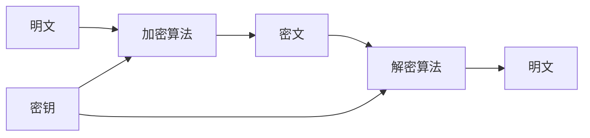

# 基础概念

了解密码学的基本概念，帮助你更好地使用 @ldesign/crypto。

## 密码学基础

### 什么是加密？

加密是将明文（可读信息）转换为密文（不可读信息）的过程，只有拥有正确密钥的人才能解密还原明文。



### 加密的目标

1. **机密性 (Confidentiality)**: 确保信息只能被授权人员访问
2. **完整性 (Integrity)**: 确保信息在传输过程中未被篡改
3. **认证性 (Authentication)**: 确认信息来源的真实性
4. **不可否认性 (Non-repudiation)**: 防止发送方否认已发送的信息

## 加密算法分类

### 对称加密 (Symmetric Encryption)

使用相同的密钥进行加密和解密。

**特点:**
- ✅ 加密速度快，适合大量数据
- ✅ 算法相对简单
- ❌ 密钥分发困难
- ❌ 密钥管理复杂

**常用算法:**
- **AES** (Advanced Encryption Standard) - 推荐使用
- **DES** (Data Encryption Standard) - 已不安全
- **3DES** (Triple DES) - 兼容性使用
- **SM4** - 中国国密标准

```typescript
// AES 对称加密示例
const crypto = createCrypto()
const key = crypto.generateKey('AES', 256)

// 加密
const encrypted = await crypto.aesEncrypt('Hello World', {
  key,
  mode: 'CBC'
})

// 解密
const decrypted = await crypto.aesDecrypt(encrypted.data, {
  key,
  mode: 'CBC'
})
```

### 非对称加密 (Asymmetric Encryption)

使用一对密钥：公钥用于加密，私钥用于解密。

**特点:**
- ✅ 解决了密钥分发问题
- ✅ 支持数字签名
- ❌ 加密速度慢
- ❌ 不适合大量数据

**常用算法:**
- **RSA** - 最广泛使用的非对称算法
- **ECC** (Elliptic Curve Cryptography) - 更高效的椭圆曲线算法
- **SM2** - 中国国密椭圆曲线算法

```typescript
// RSA 非对称加密示例
const keyPair = await crypto.generateRSAKeyPair(2048)

// 公钥加密
const encrypted = await crypto.rsaEncrypt('Hello World', {
  publicKey: keyPair.publicKey
})

// 私钥解密
const decrypted = await crypto.rsaDecrypt(encrypted.data, {
  privateKey: keyPair.privateKey
})
```

### 哈希算法 (Hash Functions)

将任意长度的输入转换为固定长度的输出。

**特点:**
- ✅ 单向函数，不可逆
- ✅ 输入微小变化导致输出巨大变化
- ✅ 相同输入总是产生相同输出
- ✅ 计算速度快

**常用算法:**
- **SHA-256** - 安全哈希算法，推荐使用
- **SHA-512** - 更长的哈希值
- **MD5** - 已不安全，仅用于兼容性
- **SM3** - 中国国密哈希算法

```typescript
// 哈希算法示例
const hash256 = await crypto.sha256('Hello World')
const hash512 = await crypto.sha512('Hello World')
const md5Hash = await crypto.md5('Hello World')
const sm3Hash = await crypto.sm3('Hello World')
```

## 加密模式

### 分组密码模式

对称加密算法通常是分组密码，需要选择合适的加密模式。

#### ECB (Electronic Codebook)
- **特点**: 最简单的模式，每个分组独立加密
- **优点**: 简单，支持并行处理
- **缺点**: 相同明文产生相同密文，不安全
- **适用**: 仅用于加密少量数据

#### CBC (Cipher Block Chaining)
- **特点**: 每个分组与前一个密文分组异或后再加密
- **优点**: 相同明文产生不同密文
- **缺点**: 不支持并行加密
- **适用**: 最常用的模式，推荐使用

#### CFB (Cipher Feedback)
- **特点**: 将分组密码转换为流密码
- **优点**: 不需要填充
- **缺点**: 错误会传播
- **适用**: 流数据加密

#### OFB (Output Feedback)
- **特点**: 生成密钥流与明文异或
- **优点**: 错误不会传播
- **缺点**: 对同步要求高
- **适用**: 容错要求高的场景

#### CTR (Counter)
- **特点**: 计数器模式，支持并行处理
- **优点**: 支持随机访问
- **缺点**: 计数器不能重复
- **适用**: 高性能场景

#### GCM (Galois/Counter Mode)
- **特点**: 认证加密模式
- **优点**: 同时提供加密和认证
- **缺点**: 实现复杂
- **适用**: 需要认证的场景

```typescript
// 不同加密模式示例
const key = crypto.generateKey('AES', 256)
const data = 'Hello World'

// ECB 模式
const ecb = await crypto.aesEncrypt(data, { key, mode: 'ECB' })

// CBC 模式（推荐）
const cbc = await crypto.aesEncrypt(data, { key, mode: 'CBC' })

// GCM 模式（认证加密）
const gcm = await crypto.aesEncrypt(data, { key, mode: 'GCM' })
```

## 填充方式

当数据长度不是分组大小的整数倍时，需要进行填充。

### PKCS7 Padding
- **特点**: 最常用的填充方式
- **规则**: 填充字节的值等于填充字节的数量
- **适用**: 大多数场景

### PKCS5 Padding
- **特点**: PKCS7 的子集，固定8字节分组
- **规则**: 与 PKCS7 相同，但仅用于8字节分组
- **适用**: DES 等8字节分组算法

### Zero Padding
- **特点**: 用零字节填充
- **规则**: 在数据末尾添加零字节
- **适用**: 特定协议要求

### No Padding
- **特点**: 不进行填充
- **规则**: 数据长度必须是分组大小的整数倍
- **适用**: 流密码模式

```typescript
// 不同填充方式示例
const key = crypto.generateKey('AES', 256)
const data = 'Hello'

// PKCS7 填充（默认）
const pkcs7 = await crypto.aesEncrypt(data, {
  key,
  mode: 'CBC',
  padding: 'PKCS7'
})

// Zero 填充
const zero = await crypto.aesEncrypt(data, {
  key,
  mode: 'CBC',
  padding: 'ZeroPadding'
})
```

## 密钥管理

### 密钥生成

```typescript
// 生成不同类型的密钥
const aesKey = crypto.generateKey('AES', 256)        // AES-256 密钥
const desKey = crypto.generateKey('DES')             // DES 密钥
const sm4Key = crypto.generateKey('SM4')             // SM4 密钥

// 生成非对称密钥对
const rsaKeyPair = await crypto.generateRSAKeyPair(2048)
const eccKeyPair = await crypto.generateECCKeyPair('P-256')
const sm2KeyPair = await crypto.generateSM2KeyPair()
```

### 密钥存储

```typescript
// 密钥序列化
const keyData = {
  algorithm: 'AES',
  keySize: 256,
  key: aesKey,
  createdAt: new Date().toISOString()
}

// 安全存储（示例）
localStorage.setItem('crypto-key', JSON.stringify(keyData))

// 密钥恢复
const storedKey = JSON.parse(localStorage.getItem('crypto-key'))
```

### 密钥派生

```typescript
// 从密码派生密钥
const derivedKey = await crypto.pbkdf2('password123', {
  salt: 'random-salt',
  iterations: 100000,
  keyLength: 32,
  algorithm: 'SHA-256'
})

// HMAC 密钥派生
const hmacKey = await crypto.hmac('master-key', 'context-info', {
  algorithm: 'SHA-256'
})
```

## 数字签名

数字签名用于验证数据的完整性和来源的真实性。

### 签名过程

1. 计算数据的哈希值
2. 使用私钥对哈希值进行签名
3. 将签名附加到数据上

### 验证过程

1. 计算数据的哈希值
2. 使用公钥验证签名
3. 比较哈希值是否一致

```typescript
// RSA 数字签名
const keyPair = await crypto.generateRSAKeyPair(2048)
const data = 'Important document'

// 签名
const signature = await crypto.rsaSign(data, {
  privateKey: keyPair.privateKey,
  algorithm: 'SHA-256'
})

// 验证
const verified = await crypto.rsaVerify(data, signature.signature, {
  publicKey: keyPair.publicKey,
  algorithm: 'SHA-256'
})

console.log('签名验证:', verified.valid)
```

## 消息认证码 (MAC)

### HMAC (Hash-based MAC)

使用哈希函数和密钥生成消息认证码。

```typescript
// HMAC 示例
const key = crypto.generateKey('HMAC', 256)
const data = 'Message to authenticate'

// 生成 HMAC
const hmac = await crypto.hmac(data, key, {
  algorithm: 'SHA-256'
})

// 验证 HMAC
const valid = await crypto.verifyHmac(data, hmac.data, key, {
  algorithm: 'SHA-256'
})
```

## 随机数生成

### 加密安全的随机数

```typescript
// 生成随机字节
const randomBytes = crypto.generateRandom({ length: 32 })

// 生成随机字符串
const randomHex = crypto.generateRandom({
  length: 32,
  charset: 'hex'
})

const randomBase64 = crypto.generateRandom({
  length: 32,
  charset: 'base64'
})

// 生成随机密码
const password = crypto.generateRandom({
  length: 16,
  charset: 'alphanumeric'
})
```

## 编码转换

### 支持的编码格式

- **hex**: 十六进制编码
- **base64**: Base64 编码
- **utf8**: UTF-8 文本编码
- **binary**: 二进制数据

```typescript
// 编码转换示例
const data = 'Hello World'

// 转换为不同编码
const hex = crypto.encode(data, 'hex')
const base64 = crypto.encode(data, 'base64')

// 解码
const decoded = crypto.decode(hex, 'hex')
```

## 性能考虑

### 算法选择建议

| 场景 | 推荐算法 | 原因 |
|------|----------|------|
| 大文件加密 | AES-256-GCM | 速度快，提供认证 |
| 密钥交换 | RSA-2048 或 ECC-P256 | 安全性高 |
| 数据完整性 | SHA-256 | 平衡安全性和性能 |
| 密码存储 | PBKDF2 + SHA-256 | 抗暴力破解 |
| 国密要求 | SM2/SM3/SM4 | 符合国家标准 |

### 性能优化技巧

1. **批量处理**: 一次处理多个数据块
2. **异步操作**: 使用 Web Workers 避免阻塞
3. **缓存结果**: 缓存计算结果避免重复计算
4. **选择合适算法**: 根据场景选择最优算法

```typescript
// 性能优化示例
const crypto = createCrypto({
  performance: { enabled: true },
  cache: { enabled: true }
})

// 批量哈希计算
const files = ['file1.txt', 'file2.txt', 'file3.txt']
const hashes = await Promise.all(
  files.map(file => crypto.sha256(file))
)
```

## 安全最佳实践

1. **使用强密钥**: 密钥长度足够，随机性好
2. **定期更换密钥**: 避免长期使用同一密钥
3. **安全存储**: 密钥不要明文存储
4. **选择安全算法**: 避免使用已知不安全的算法
5. **验证输入**: 验证所有输入参数
6. **错误处理**: 不要泄露敏感信息

## 下一步

- 学习 [对称加密](/guide/symmetric) 的详细用法
- 了解 [非对称加密](/guide/asymmetric) 的应用场景
- 探索 [国密算法](/guide/sm-crypto) 的特色功能
