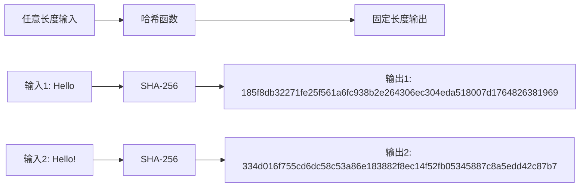

# 哈希算法

哈希算法将任意长度的输入转换为固定长度的输出，广泛用于数据完整性验证、密码存储、数字签名等场景。

## 核心特性

### 哈希函数的性质

1. **确定性**: 相同输入总是产生相同输出
2. **单向性**: 从哈希值无法推导出原始输入
3. **雪崩效应**: 输入微小变化导致输出巨大变化
4. **抗碰撞性**: 很难找到两个不同输入产生相同哈希值



## 支持的算法

### SHA 系列（推荐）

#### SHA-256
```typescript
import { createCrypto } from '@ldesign/crypto'

const crypto = createCrypto()
await crypto.init()

// SHA-256 哈希
const hash = await crypto.sha256('Hello World')
console.log('SHA-256:', hash.data)
// 输出: a591a6d40bf420404a011733cfb7b190d62c65bf0bcda32b57b277d9ad9f146e

// 带盐值的哈希
const saltedHash = await crypto.sha256('Hello World', {
  salt: 'random-salt-123'
})
console.log('加盐 SHA-256:', saltedHash.data)
```

#### SHA-512
```typescript
// SHA-512 哈希（更长的输出）
const hash512 = await crypto.sha512('Hello World')
console.log('SHA-512:', hash512.data)

// 自定义输出长度
const hash384 = await crypto.sha512('Hello World', {
  outputLength: 384 // SHA-384
})
```

#### SHA-1
```typescript
// SHA-1（不推荐用于安全场景）
const sha1Hash = await crypto.sha1('Hello World')
console.log('SHA-1:', sha1Hash.data)
```

### MD5（兼容性支持）

```typescript
// MD5（仅用于兼容性，不推荐用于安全场景）
const md5Hash = await crypto.md5('Hello World')
console.log('MD5:', md5Hash.data)
// 输出: b10a8db164e0754105b7a99be72e3fe5
```

### 国密 SM3

```typescript
// SM3 国密哈希算法
const sm3Hash = await crypto.sm3('Hello World')
console.log('SM3:', sm3Hash.data)

// 带用户标识的 SM3
const sm3WithId = await crypto.sm3('Hello World', {
  userId: '1234567812345678'
})
```

## 文件哈希计算

### 大文件分块处理

```typescript
// 计算文件哈希
async function calculateFileHash(file: File) {
  const chunkSize = 1024 * 1024 // 1MB 分块
  const hasher = crypto.createHasher('SHA-256')

  for (let offset = 0; offset < file.size; offset += chunkSize) {
    const chunk = file.slice(offset, offset + chunkSize)
    const arrayBuffer = await chunk.arrayBuffer()
    hasher.update(new Uint8Array(arrayBuffer))
  }

  return hasher.finalize()
}

// 使用示例
const fileInput = document.querySelector('input[type="file"]')
fileInput.addEventListener('change', async (event) => {
  const file = event.target.files[0]
  if (file) {
    const hash = await calculateFileHash(file)
    console.log(`文件 ${file.name} 的哈希值:`, hash)
  }
})
```

### 流式哈希计算

```typescript
// 创建流式哈希器
const hasher = crypto.createHasher('SHA-256')

// 逐步添加数据
hasher.update('Hello ')
hasher.update('World')
hasher.update('!')

// 获取最终哈希值
const finalHash = hasher.finalize()
console.log('流式哈希结果:', finalHash)

// 重置哈希器以便重新使用
hasher.reset()
```

## HMAC 消息认证码

### 基础用法

```typescript
// 生成 HMAC 密钥
const hmacKey = crypto.generateKey('HMAC', 256)

// 计算 HMAC
const hmac = await crypto.hmac('Message to authenticate', hmacKey, {
  algorithm: 'SHA-256'
})

console.log('HMAC:', hmac.data)

// 验证 HMAC
const isValid = await crypto.verifyHmac(
  'Message to authenticate',
  hmac.data,
  hmacKey,
  { algorithm: 'SHA-256' }
)

console.log('HMAC 验证:', isValid)
```

### 不同算法的 HMAC

```typescript
const message = 'Important message'
const key = crypto.generateKey('HMAC', 256)

// HMAC-SHA256
const hmacSha256 = await crypto.hmac(message, key, { algorithm: 'SHA-256' })

// HMAC-SHA512
const hmacSha512 = await crypto.hmac(message, key, { algorithm: 'SHA-512' })

// HMAC-SM3
const hmacSm3 = await crypto.hmac(message, key, { algorithm: 'SM3' })

console.log('HMAC-SHA256:', hmacSha256.data)
console.log('HMAC-SHA512:', hmacSha512.data)
console.log('HMAC-SM3:', hmacSm3.data)
```

## PBKDF2 密钥派生

### 密码哈希存储

```typescript
// 安全的密码哈希
async function hashPassword(password: string) {
  const salt = crypto.generateRandom({ length: 32, charset: 'hex' })

  const hash = await crypto.pbkdf2(password, {
    salt,
    iterations: 100000, // 迭代次数
    keyLength: 32, // 输出长度
    algorithm: 'SHA-256' // 哈希算法
  })

  return {
    hash: hash.data,
    salt,
    iterations: 100000,
    algorithm: 'SHA-256'
  }
}

// 验证密码
async function verifyPassword(password: string, stored: any) {
  const hash = await crypto.pbkdf2(password, {
    salt: stored.salt,
    iterations: stored.iterations,
    keyLength: 32,
    algorithm: stored.algorithm
  })

  return hash.data === stored.hash
}

// 使用示例
const password = 'user-password-123'
const hashedPassword = await hashPassword(password)
console.log('密码哈希:', hashedPassword)

const isCorrect = await verifyPassword(password, hashedPassword)
console.log('密码验证:', isCorrect)
```

### 密钥派生

```typescript
// 从主密钥派生子密钥
async function deriveKeys(masterPassword: string, salt: string) {
  // 派生加密密钥
  const encryptionKey = await crypto.pbkdf2(masterPassword, {
    salt: `${salt}-encryption`,
    iterations: 100000,
    keyLength: 32,
    algorithm: 'SHA-256'
  })

  // 派生认证密钥
  const authKey = await crypto.pbkdf2(masterPassword, {
    salt: `${salt}-auth`,
    iterations: 100000,
    keyLength: 32,
    algorithm: 'SHA-256'
  })

  return {
    encryptionKey: encryptionKey.data,
    authKey: authKey.data
  }
}
```

## 数据完整性验证

### 文件完整性校验

```typescript
class FileIntegrityChecker {
  private checksums = new Map<string, string>()

  // 计算并存储文件校验和
  async addFile(fileName: string, fileData: string | ArrayBuffer) {
    const hash = await crypto.sha256(fileData)
    this.checksums.set(fileName, hash.data)
    return hash.data
  }

  // 验证文件完整性
  async verifyFile(fileName: string, fileData: string | ArrayBuffer) {
    const storedHash = this.checksums.get(fileName)
    if (!storedHash) {
      throw new Error('文件校验和不存在')
    }

    const currentHash = await crypto.sha256(fileData)
    return currentHash.data === storedHash
  }

  // 获取所有文件的校验和
  getAllChecksums() {
    return Object.fromEntries(this.checksums)
  }
}

// 使用示例
const checker = new FileIntegrityChecker()

// 添加文件
await checker.addFile('document.txt', 'Important document content')
await checker.addFile('image.jpg', imageArrayBuffer)

// 验证文件
const isValid = await checker.verifyFile('document.txt', 'Important document content')
console.log('文件完整性:', isValid)
```

### 数据传输验证

```typescript
// 数据包完整性验证
class DataPacket {
  constructor(
    public data: string,
    public checksum: string,
    public timestamp: number
  ) {}

  static async create(data: string) {
    const hash = await crypto.sha256(data)
    return new DataPacket(data, hash.data, Date.now())
  }

  async verify() {
    const hash = await crypto.sha256(this.data)
    return hash.data === this.checksum
  }

  isExpired(maxAge: number = 300000) { // 5分钟
    return Date.now() - this.timestamp > maxAge
  }
}

// 使用示例
const packet = await DataPacket.create('Sensitive data to transmit')
console.log('数据包:', packet)

// 接收端验证
const isValid = await packet.verify()
const isExpired = packet.isExpired()

console.log('数据包验证:', isValid && !isExpired)
```

## 性能优化

### 批量哈希计算

```typescript
// 并行计算多个哈希
async function batchHash(data: string[], algorithm = 'SHA-256') {
  return Promise.all(
    data.map(item => crypto.hash(item, algorithm))
  )
}

// 使用示例
const dataList = ['data1', 'data2', 'data3', 'data4']
const hashes = await batchHash(dataList)
console.log('批量哈希结果:', hashes)
```

### 哈希缓存

```typescript
class HashCache {
  private cache = new Map<string, string>()
  private maxSize = 1000

  async getHash(data: string, algorithm = 'SHA-256') {
    const cacheKey = `${algorithm}:${data}`

    if (this.cache.has(cacheKey)) {
      return this.cache.get(cacheKey)
    }

    const hash = await crypto.hash(data, algorithm)

    // 简单的 LRU 缓存
    if (this.cache.size >= this.maxSize) {
      const firstKey = this.cache.keys().next().value
      this.cache.delete(firstKey)
    }

    this.cache.set(cacheKey, hash.data)
    return hash.data
  }

  clearCache() {
    this.cache.clear()
  }
}

const hashCache = new HashCache()
const hash = await hashCache.getHash('test data')
```

## 安全考虑

### 算法选择建议

| 用途 | 推荐算法 | 原因 |
|------|----------|------|
| 数据完整性 | SHA-256 | 安全性和性能平衡 |
| 密码存储 | PBKDF2 + SHA-256 | 抗暴力破解 |
| 数字签名 | SHA-256/SHA-512 | 高安全性 |
| 快速校验 | SHA-256 | 广泛支持 |
| 国密要求 | SM3 | 符合国家标准 |

### 安全最佳实践

```typescript
// ✅ 正确：使用强哈希算法
const secureHash = await crypto.sha256(data)

// ❌ 错误：使用弱哈希算法
const weakHash = await crypto.md5(data) // 仅用于兼容性

// ✅ 正确：密码哈希使用盐值和多次迭代
const passwordHash = await crypto.pbkdf2(password, {
  salt: randomSalt,
  iterations: 100000
})

// ❌ 错误：直接哈希密码
const directHash = await crypto.sha256(password) // 不安全

// ✅ 正确：使用 HMAC 进行消息认证
const authenticatedMessage = await crypto.hmac(message, secretKey)

// ❌ 错误：仅使用哈希进行认证
const unauthenticatedHash = await crypto.sha256(message) // 可被篡改
```

### 时间攻击防护

```typescript
// 安全的哈希比较（防止时间攻击）
function secureCompare(hash1: string, hash2: string): boolean {
  if (hash1.length !== hash2.length) {
    return false
  }

  let result = 0
  for (let i = 0; i < hash1.length; i++) {
    result |= hash1.charCodeAt(i) ^ hash2.charCodeAt(i)
  }

  return result === 0
}

// 使用示例
const storedHash = 'stored-hash-value'
const computedHash = await crypto.sha256('user-input')

const isValid = secureCompare(storedHash, computedHash.data)
```

## 实际应用场景

### 1. 用户认证系统

```typescript
class UserAuth {
  async registerUser(username: string, password: string) {
    // 生成随机盐值
    const salt = crypto.generateRandom({ length: 32, charset: 'hex' })

    // 哈希密码
    const passwordHash = await crypto.pbkdf2(password, {
      salt,
      iterations: 100000,
      keyLength: 32,
      algorithm: 'SHA-256'
    })

    // 存储用户信息
    return {
      username,
      passwordHash: passwordHash.data,
      salt,
      createdAt: new Date().toISOString()
    }
  }

  async authenticateUser(username: string, password: string, storedUser: any) {
    const passwordHash = await crypto.pbkdf2(password, {
      salt: storedUser.salt,
      iterations: 100000,
      keyLength: 32,
      algorithm: 'SHA-256'
    })

    return secureCompare(passwordHash.data, storedUser.passwordHash)
  }
}
```

### 2. 区块链哈希

```typescript
class SimpleBlock {
  constructor(
    public index: number,
    public data: string,
    public previousHash: string,
    public timestamp: number = Date.now(),
    public nonce: number = 0
  ) {}

  async calculateHash(): Promise<string> {
    const blockData = `${this.index}${this.data}${this.previousHash}${this.timestamp}${this.nonce}`
    const hash = await crypto.sha256(blockData)
    return hash.data
  }

  async mineBlock(difficulty: number): Promise<void> {
    const target = '0'.repeat(difficulty)

    while (true) {
      const hash = await this.calculateHash()
      if (hash.substring(0, difficulty) === target) {
        console.log(`区块挖掘成功: ${hash}`)
        break
      }
      this.nonce++
    }
  }
}

// 使用示例
const block = new SimpleBlock(1, 'Transaction data', 'previous-hash')
await block.mineBlock(4) // 挖掘难度为4的区块
```

### 3. 文件去重系统

```typescript
class FileDeduplication {
  private fileHashes = new Map<string, string[]>()

  async addFile(fileName: string, fileData: ArrayBuffer) {
    const hash = await crypto.sha256(fileData)

    if (!this.fileHashes.has(hash.data)) {
      this.fileHashes.set(hash.data, [])
    }

    this.fileHashes.get(hash.data)!.push(fileName)

    return {
      hash: hash.data,
      isDuplicate: this.fileHashes.get(hash.data)!.length > 1,
      duplicateFiles: this.fileHashes.get(hash.data)!
    }
  }

  getDuplicates() {
    const duplicates = new Map<string, string[]>()

    for (const [hash, files] of this.fileHashes) {
      if (files.length > 1) {
        duplicates.set(hash, files)
      }
    }

    return duplicates
  }
}
```

## 下一步

- 学习 [国密算法](/guide/sm-crypto) 的特色功能
- 了解 [Vue 3 集成](/guide/vue-integration) 的用法
- 查看 [性能监控](/guide/performance) 的配置
